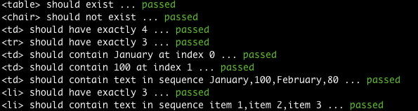

Puer
====

Yet another 'tea'-inspired testing frameowrk

# puer.js

- Provide a basic set of _should_ matchers
- Serve as the reference implementation. All _should_ matchers are currently implemented using regular expressions.

# puer-cheerio.js

- Re-implement all the matchers
- Use [cheerio](https://github.com/cheeriojs/cheerio) to parse and traverse the DOM to perform matching

# Test
_puer.test.js_ contains code to test the functionality of this testing library

Run the test code by

	$ node puer.test.js

Output in the terminal

Run with debug messages turned on

	$ DEBUG=puer puer.test.js
